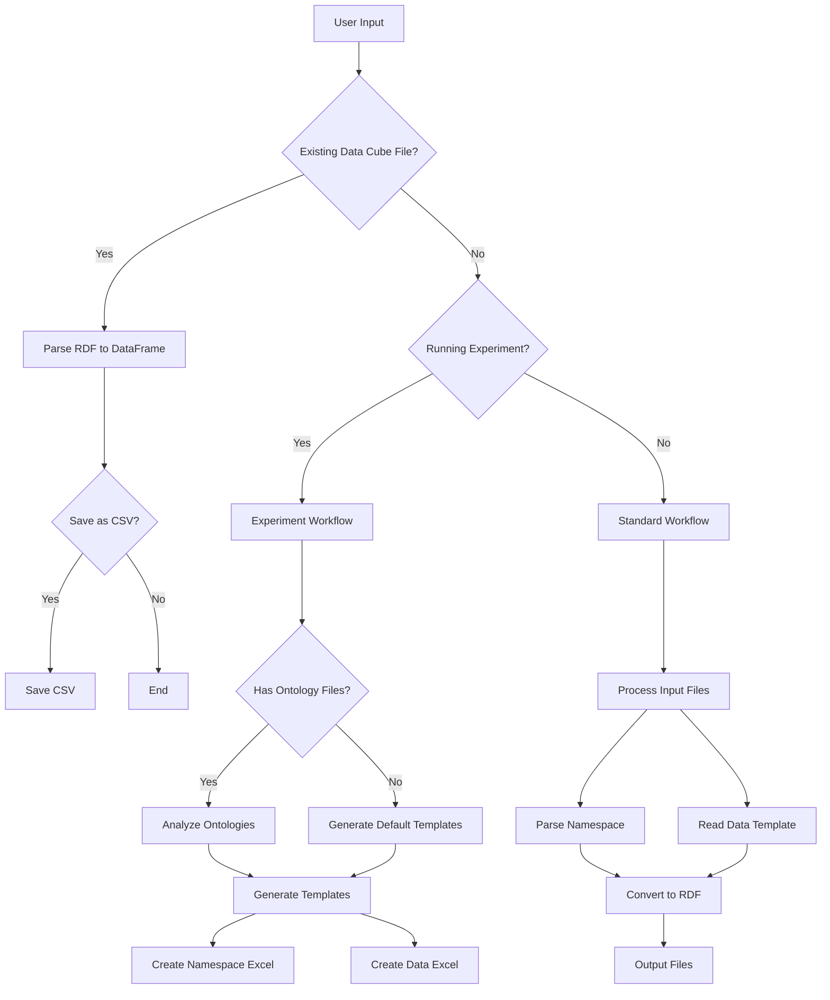

------------------
FAIRLinked
------------------

**Authors:**  
**Balashanmuga Priyan Rajamohan**, Kai Zheng, Benjamin Pierce, Yinghui Wu, Laura Bruckman, Erika I. Barcelos, Roger H. French

**Affiliation:**  
Materials Data Science for Stockpile Stewardship Center of Excellence,  
Cleveland, OH 44106, USA


**Python Installation:**

```bash
pip install FAIRLinked
```

**Package Usage:**

```bash
FAIRLinked
```




# Acknowledgment:
This work was supported by the U.S. Department of Energy’s Office of Energy Efficiency and Renewable Energy (EERE) under the Solar Energy Technologies Office (SETO) Agreement Numbers DE-EE0009353 and DE-EE0009347; the Department of Energy (National Nuclear Security Administration) under Award Number DE-NA0004104 and Contract Number B647887; and the U.S. National Science Foundation under Award Number 2133576.