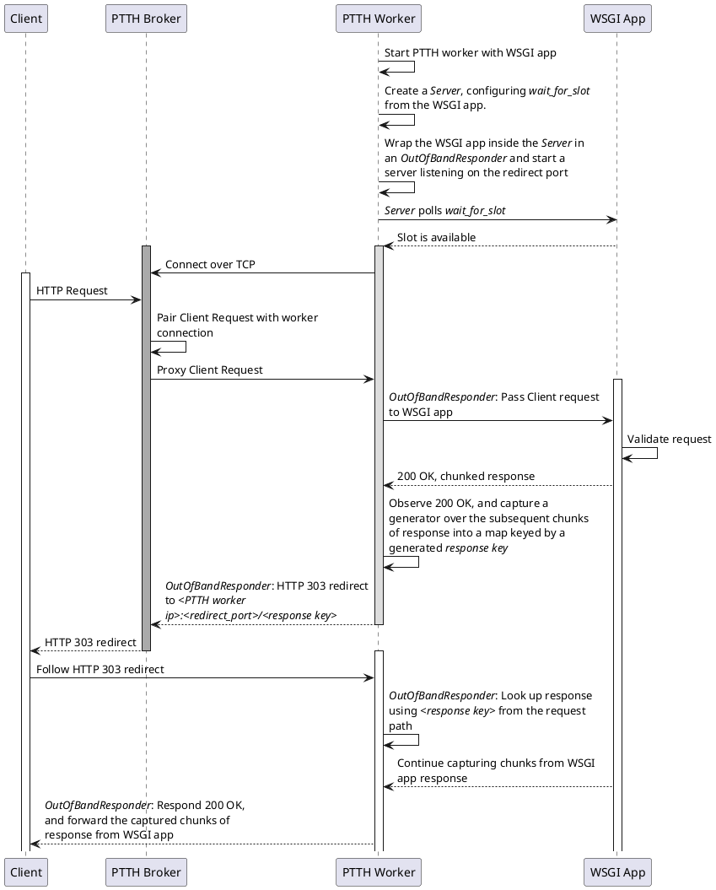

POTHEAD
=======

What?
-----

POTHEAD uses a reverse-http proxy solution to improve request-latency when load-balancing expensive non-concurrent HTTP requests.

### Why?
A certain class of http-backend-requests are poorly served by regular HTTP-load-balancing solutions, whether hashed or round-robin. This class of requests cannot efficiently over-use resources in the worker, for example due to breaking RAM-limits, or concurrency causing non-optimal CPU cache use. In a traditional forwarding HTTP load-balancer, the worker can throttle incoming requests by slowing down "accept"-rate, but doing so would increase latency and potentially leave free workers unused. One prime example is transcoders of audio, video or images, which is typically CPU-intensive and cache-sensitive.

### How?
POTHEAD solves this problem by employing "reverse"-HTTP on the worker side. The TCP "client" (the worker initiating the TCP-connection), implements the server side of the HTTP, protocol, waiting for the TCP "server" to initiate the HTTP request. Both the workers and the service consumers connect to a service hub. Requests from the consumers are queued by the hub and dequed when a worker connects. The worker can thus control how many parallel connections to maintain, thereby the concurrency of the requests.

### Why not?
To control the concurrency, the worker might need to employ `Connection: close` in order to accept a new request only when resources are available. This TCP reconnection leads to some overhead in network traffic, latency, and could lead to the TCP "lingering" problem. Therefore it's not recommended to use POTHEAD for requests with less than 50ms of average execution time.

## Prometheus metrics
If the env variables `PROMETHEUS_MULTIPROC_DIR` is set to an existing directory it will be wiped and used for [prometheus client in multiprocess mode](https://prometheus.github.io/client_python/multiprocess/). The variable `PROMETHEUS_PORT` can be used to change metrics export web server port (default 9090).

### Usage in worker

Usage is the standard [prometheus-client](https://prometheus.github.io/client_python/) usage:

```python
from prometheus_client import Counter

REQUEST_TOTAL = Counter(
    'requests_total',
    'Total HTTP requests',
    ['method', 'endpoint']
)

def app(environ, start_response):
    REQUEST_TOTAL.labels(
        method=environ['REQUEST_METHOD'],
        endpoint=environ['PATH_INFO']
    ).inc()
    start_response("200 OK", [('Content-Type','text/plain; charset=utf-8')])
    return ['hello'.encode('utf-8')];
```

### (Why "POTHEAD"?)
Because PTTH was taken.

Ok, ok. How do I get started?
-----------------------------
This implementation provides a hub based on `aiohttp`. It will open up two ports, one main port for consumers and one for workers. Run with `python3 -m pothead.server`.

It also includes a WSGI-enabled worker-runner, allowing you to host your regular WSGI-app through POTHEAD. Run using `python3 -m pothead.worker --connect <host>:<port> <module>:<app-symbol>`.

The runner have a couple of useful features, one being a gating-based "--poll-jobs" mode, where a `wait_for_slot` implemented on the provided app-object allows the application to dynamically pull jobs matching based on available resources. A standard implementation for CPU-usage-based gating is provided in `pothead.gating`.

Another worker-feature worth mentioning is "--redirect-response". Running in this mode, the worker will automatically and transparently redirect any successful (200) responses from this WSGI-app, to a direct port of the worker. This is useful to avoid the PTTH-broker becoming a bottleneck of network bandwidth.

Run tests with `tox`. If you're on MacOS and the build fails, use a Docker container: `docker build -f dev.Dockerfile -t pothead-dev . && docker run -it -v $PWD:$PWD -w $PWD pothead-dev`.

Err, could you show me some UML?
--------------------------------

Redirection mode:


What then?
----------
How would I know? You tell me.

License
-------
Copyright 2019 Ulrik Mikaelsson

   Licensed under the Apache License, Version 2.0 (the "License");
   you may not use this file except in compliance with the License.
   You may obtain a copy of the License at

       http://www.apache.org/licenses/LICENSE-2.0

   Unless required by applicable law or agreed to in writing, software
   distributed under the License is distributed on an "AS IS" BASIS,
   WITHOUT WARRANTIES OR CONDITIONS OF ANY KIND, either express or implied.
   See the License for the specific language governing permissions and
   limitations under the License.
