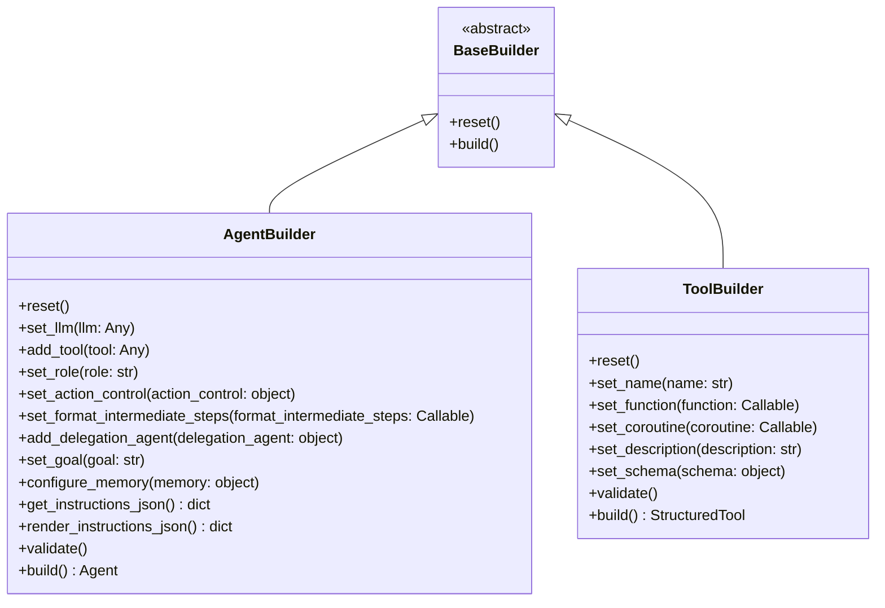
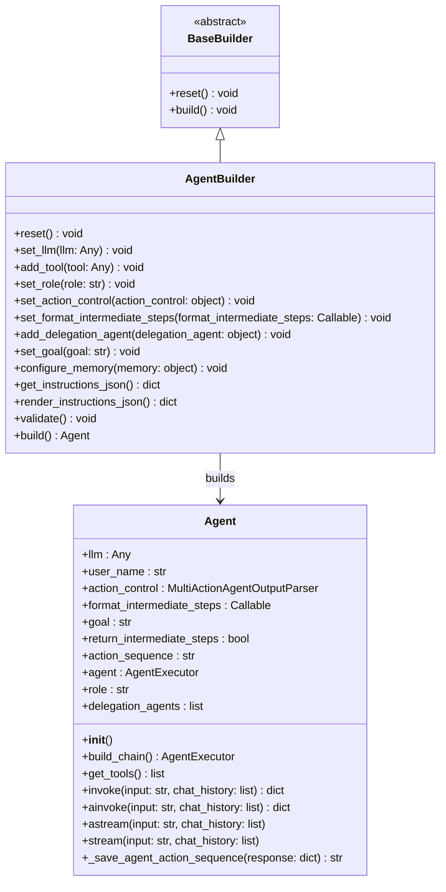

[](https://recall.space/)
[](https://www.python.org/)
[](https://github.com/psf/black)

| Environment | Version |
| ----------- | ------- |
| Production  | 0.0.1   |
| Development | 0.0.1   |

```
pip install agent-builder
```

# 🛠️ agent-builder

The **agent-builder** package provides a modular framework for building autonomous agents and tools. It enables easy configuration and assembly of agents by utilizing a builder pattern. This package is designed to integrate with large language models (LLMs) and tools to create highly adaptable agents for various tasks.

## Key Features

1. **Builder Pattern**: The package follows a flexible builder pattern that allows users to define agents with customizable components such as tools, goals, memory, and more.
2. **Tool Building**: Provides a `ToolBuilder` for constructing tools with functions, descriptions, and schemas.
3. **Agent Construction**: The `AgentBuilder` allows for constructing agents with roles, action control, memory, and delegation capabilities.
4. **Modular Design**: The package is designed to be easily extended with new agents, tools, and custom components.

## UML Class Design


### Builder design pattern



## How to Use
1. Building a Tool
You can use the ToolBuilder to define a tool with a function, description, and schema.

```python
from pydantic import BaseModel, Field
from agent_builder.builders.tool_builder import ToolBuilder

# Define your schema as a subclass of BaseModel
class GetTemperatureSchema(BaseModel):
    city: str = Field(description="City for which temperature has to be checked.")

# Example function to use with the tool
def get_temperature(city: str) -> float:
    return 30.1


# Creating the tool

# Instantiate the tool builder.
tool_builder = ToolBuilder()
# Define name of tool.
tool_builder.set_name(name="get-temparature-tool")
# Set the function for the tool.
tool_builder.set_function(function=get_temperature)
# Provide the description for tool
tool_builder.set_description(description="Tool to get temperature of given city")
# Add the tool schema
tool_builder.set_schema(schema=GetTemperatureSchema)
# Build and get the tool
get_temperature_tool = tool_builder.build()
```

Note: To learn more on how the tool is defined please refer:
https://api.python.langchain.com/en/latest/tools/langchain_core.tools.StructuredTool.html

2. Building an Agent

Use the AgentBuilder to construct an agent with tools, memory, and other attributes.

```python
from agent_builder.builders.agent_builder import AgentBuilder
from langchain_openai import ChatOpenAI

# Initialize LLM (Large Language Model)
llm = ChatOpenAI(
    model="gpt-4o", 
    api_key="OPENAI KEY",
    base_url="https://api.openai.com/v1"
)

# Create an agent
agent_builder = AgentBuilder()
agent_builder.set_goal(
    """You are customer service respresentative at weather forecast agency. 
    Your duty is to help user with query related to forecast."""
)
agent_builder.set_llm(llm)

agent_builder.add_tool(get_temperature_tool)
agent = agent_builder.build()

# Now the agent can invoke the tool
response = agent.invoke(input="Hi, what is current temperature of Pune", chat_history=[])
```
