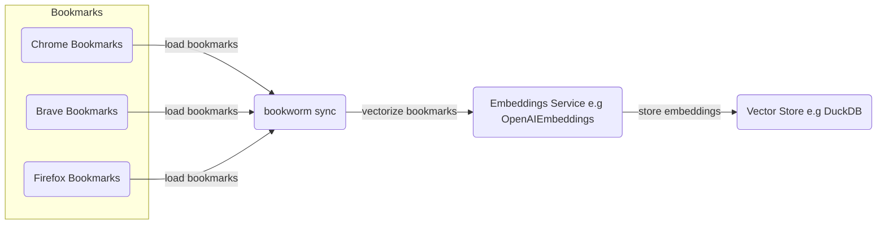
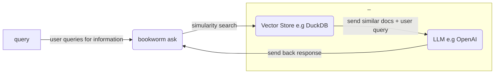

# bookworm 📖

[](https://github.com/kiran94/bookworm/actions/workflows/main.yml) [](https://badge.fury.io/py/bookworm_genai)

> LLM-powered bookmark search engine

`bookworm` allows you to search your locally stored bookmarks using human language.

## Install

```bash
python -m pip install bookworm_genai
```

## Usage

```bash
export OPENAI_API_KEY=

# Run once and then anytime bookmarks across supported browsers changes
bookworm sync

# Ask questions against the bookmark database
bookworm ask

# Ask questions against the bookmark database
# Specify the query when invoking the command
# If you omit this then you will be asked for a query when the tool is running
bookworm ask -q pandas

# Ask questions against the bookmark database and specify the number of results that should come back
bookworm ask -n 1
```

The `sync` process currently supports the following configurations:

| Operating System   | Google Chrome   | Mozilla Firefox   | Brave   | Microsoft Edge   |
| ------------------ | --------------- | ----------------- | ------- | ---------------- |
| **Linux**          | ✅              | ✅                | ✅      | ❌               |
| **macOS**          | ✅              | ❌                | ❌      | ❌               |
| **Windows**        | ❌              | ❌                | ❌      | ❌               |

## Processes

*`bookworm sync`*

```python
python -m bookworm sync
```



---

*`bookworm ask`*

```python
python -m bookworm ask
```



---

## Developer Setup

```bash
# LLMs
export OPENAI_API_KEY=

# Langchain (optional, but useful for debugging)
export LANGCHAIN_API_KEY=
export LANGCHAIN_TRACING_V2=true
export LANGCHAIN_PROJECT=bookworm

# Misc (optional)
export LOGGING_LEVEL=INFO
```

Recommendations:

- Install [`pyenv`](https://github.com/pyenv/pyenv?tab=readme-ov-file#installation) and ensure [build dependencies are installed](https://github.com/pyenv/pyenv?tab=readme-ov-file#install-python-build-dependencies) for your OS.
- Install [Poetry](https://python-poetry.org/docs/) we will be using [environment management](https://python-poetry.org/docs/managing-environments/) below.


```bash
poetry env use 3.9 # or path to your 3.9 installation

poetry shell
poetry install

bookworm --help
```
