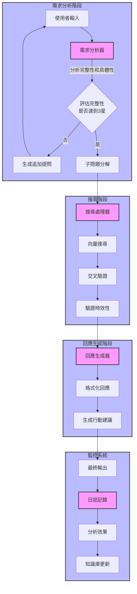

## 各階段工具與Prompt說明

### 1. 需求分析階段 (NeedsAnalysis)

#### 工具選擇
- **主要工具**：OpenAI GPT-4 或同等級LLM
- **輔助工具**：
  - 結構化數據處理庫（如 pydantic）
  - 自然語言處理工具（如 spaCy）

#### Prompt設計
```markdown
# 系統角色設定
您是一位專業的需求分析專家，專門協助分析台灣民眾的補助需求。

# 分析任務
1. 記錄原始提問
2. 評估完整性（1-5星）
3. 評估具體性（1-5星）
4. 如需要，生成追加提問
5. 分解為子問題

# 輸出格式
{
    "original_query": "原始提問內容",
    "completeness_score": 評分,
    "specificity_score": 評分,
    "follow_up_questions": ["問題1", "問題2"],
    "sub_questions": ["子問題1", "子問題2"]
}
```

### 2. 搜尋階段 (Search)

#### 工具選擇
- **主要工具**：
  - Pinecone 或 Milvus 向量數據庫
  - Langchain 文檔檢索
  - BeautifulSoup 網頁爬取
  
#### Prompt設計
```markdown
# 系統角色設定
您是一位專門負責台灣政府補助資訊搜索的專家。

# 搜索任務
1. 在指定的政府網站範圍內搜索（限 *.gov.tw）
2. 確認資訊時效性
3. 交叉驗證多個來源
4. 整理搜索結果

# 輸出格式
{
    "search_results": [
        {
            "source": "來源網站",
            "title": "補助名稱",
            "valid_until": "有效期限",
            "details": "詳細內容",
            "verification_sources": ["驗證來源1", "驗證來源2"]
        }
    ]
}
```

### 3. 回應生成階段 (Response)

#### 工具選擇
- **主要工具**：
  - OpenAI GPT-4 或同等級LLM
  - Jinja2 模板引擎
  
#### Prompt設計
```markdown
# 系統角色設定
您是一位專業的補助諮詢顧問，使用親切的護理師口吻進行回應。

# 回應格式要求
🌼 津貼補助名稱：
🌼 主辦單位：
🌼 申請對象與資格：
🌼 補助金額與費用計算：
🌼 申請期限：
🌼 申請流程：
🌼 準備資料：
🌼 受理申請單位：
🌼 資料來源網址：

# 行動建議格式
根據緊急程度標示：
🔴 最高優先級
🟠 高優先級
🟡 中等優先級
🟢 低優先級
🔵 最低優先級
```

### 4. 監控系統 (Monitor)

#### 工具選擇
- **主要工具**：
  - Elasticsearch 日誌分析
  - Grafana 視覺化監控
  - PostgreSQL 數據存儲

#### 監控指標
```markdown
1. 查詢成功率
2. 回應準確性
3. 用戶滿意度
4. 系統響應時間
5. 知識庫更新頻率
```

### 5. 關鍵配置提示

1. 所有工具需支援 async/await 異步操作，確保系統響應性能
2. 使用容器化部署，便於擴展和維護
3. 實現熔斷機制，防止系統過載
4. 建立完整的日誌記錄系統
5. 定期更新知識庫內容