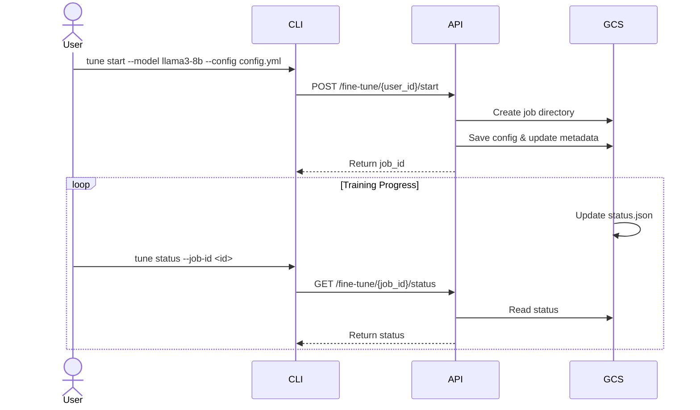
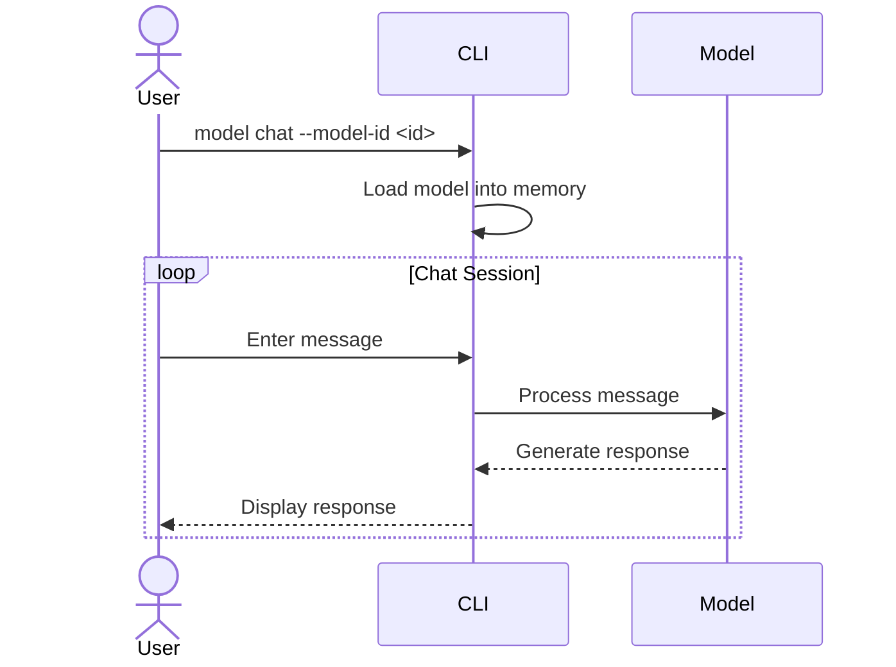

# Fine-tuning Platform Design Document

## Overview
A platform for fine-tuning large language models with usage-based billing, job management, and model serving capabilities.

## System Components

### 1. API Endpoints

#### Authentication & User Management
* `POST /auth/login` => Authenticate user for billing access

#### Fine-tuning Operations
* `POST /fine-tune/{user_id}/start` => Start fine-tuning job
* `GET /fine-tune/{job_id}/status` => Get job status
* `POST /fine-tune/{job_id}/stop` => Stop/terminate job

#### Model Management
* `GET /models/{user_id}/list` => List available models
* `GET /models/{model_id}/download` => Download model
* `DELETE /models/{model_id}` => Remove model

#### Dataset Management
* `POST /datasets/{user_id}/upload` => Upload training data
* `GET /datasets/{user_id}/list` => List datasets
* `DELETE /datasets/{dataset_id}` => Remove dataset

#### Billing Operations
* `GET /billing/usage` => Current period usage/costs
* `GET /billing/history` => Historical billing records
* `GET /billing/pricing` => Current GPU pricing
* `GET /billing/job/{job_id}/cost` => Job-specific costs

### 2. CLI Commands

#### Training Management
```bash
tune start --model llama3-8b --config config.yml --dataset dataset-id
tune list
tune status --job-id <id>
tune stop --job-id <id>
```

#### Model Operations
```bash
model list
model download --model-id <id>
model chat --model-id <id>
```

#### Dataset Operations
```bash
dataset list
dataset upload --file data.jsonl
```

#### Billing Operations
```bash
tune cost --job-id <id>
tune billing
tune billing --history
```

### 3. Storage Structure (GCS)

```
gcs/users/<user_id>/
├── metadata/                  # System metadata
│   ├── user_info.json        # User profile & settings
│   ├── jobs.json             # Jobs listing
│   ├── datasets.json         # Datasets listing
│   ├── models.json           # Models listing
│   ├── billing.json          # Billing records
│   └── gpu_pricing.json      # Pricing configuration
├── jobs/                     # Training jobs
│   └── <job_id>/
│       ├── config.yml        # Training configuration
│       ├── status.json       # Job status & metrics
│       ├── job.log          # Training logs
│       ├── checkpoints/     # Model checkpoints
│       └── events/          # Training metrics
├── data/                    # Training datasets
│   └── <dataset_id>/
│       ├── raw/            # Original data
│       ├── processed/      # Processed data
│       └── metadata.json   # Dataset info
└── models/                 # Fine-tuned models
    └── <model_id>/
        ├── weights/        # Model weights
        ├── config.json     # Model config
        └── metadata.json   # Model info
```

### 4. Metadata Schemas

#### User Info
```json
{
    "email": "user@example.com",
    "created_at": "2024-03-01T00:00:00Z",
    "status": "active",
    "last_login": "2024-03-14T10:30:00Z"
}
```

#### Jobs
```json
{
    "jobs": [{
        "job_id": "job_123",
        "model_id": "model_456",
        "dataset_id": "dataset_789",
        "status": "running",
        "created_at": "2024-03-14T10:00:00Z",
        "updated_at": "2024-03-14T10:30:00Z"
    }]
}
```

#### Billing
```json
{
    "current_period": {
        "start_date": "2024-03-01",
        "total_cost": 156.78,
        "usage_breakdown": {
            "A100": {
                "seconds": 3600,
                "cost_per_hour": 10.00,
                "total_cost": 10.00
            }
        },
        "jobs": [{
            "job_id": "job123",
            "gpu_type": "A100",
            "duration_seconds": 3600,
            "cost": 10.00
        }]
    }
}
```

### 5. Key Workflows

#### Training Flow


#### Model Chat Flow


### 6. Implementation Notes

1. GPU Usage Tracking
```python
def update_job_cost(user_id, job_id):
    status = read_status_json(user_id, job_id)
    pricing = read_gpu_pricing()
    
    gpu_type = status["gpu_metrics"]["gpu_type"]
    duration = status["gpu_metrics"]["current_duration_seconds"]
    cost_per_second = pricing[gpu_type]["cost_per_hour"] / 3600
    
    current_cost = duration * cost_per_second
    update_billing_record(user_id, job_id, current_cost)
```

2. Cost Monitoring
- Real-time usage tracking
- Cost alerts at thresholds
- Automatic job stopping at limits
- Monthly billing reports

3. Security Considerations
- Authentication required for all operations
- User data isolation
- Secure model weights storage
- Usage quotas and rate limiting


### Fine-tuning implementation
Design

The fine-tuning implementation follows these steps:

1. Mount and Setup
   - Mount GCS scripts directory containing Python implementation
   - Set job GCS path for storing artifacts
   - Expect run.yaml configuration file with job details

2. Execution Flow  
   - Python script reads run.yaml configuration
   - Launches training script which:
     - Copies base model to working directory
     - Starts Python trainer process
     - Writes output to log files
     - Copies final checkpoint back to storage

3. Why Python Implementation
   - Simpler to write compared to alternatives like Ansible
   - Built-in support for:
     - Subtask configuration 
     - Retry logic
     - Error handling
     - Direct GCS uploads
   - Can be packaged in container for remote execution
