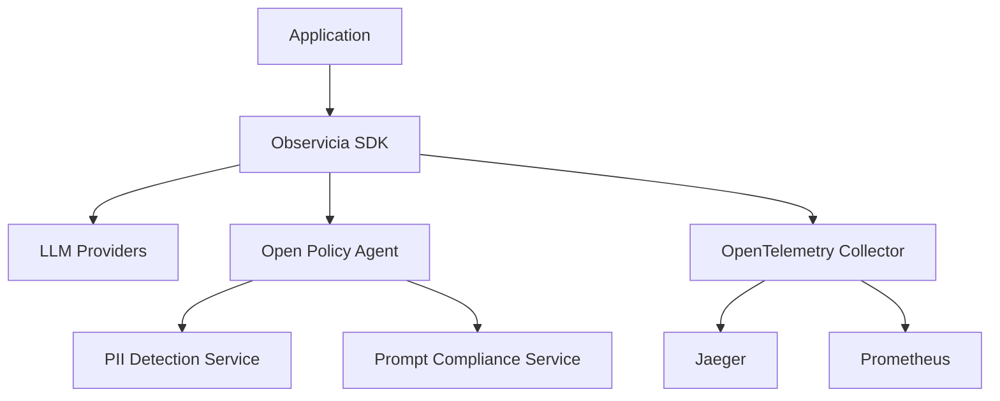

# Observicia SDK

Observicia is a Cloud Native observability and policy control SDK for LLM applications. It provides seamless integration with CNCF native observability stack while offering comprehensive token tracking, policy enforcement, and PII protection capabilities.

[](LICENSE)
[](https://opentelemetry.io/)
[](https://www.openpolicyagent.org/)

## Features

- **Token Tracking and Management**
  - Real-time token usage monitoring across providers
  - Stream-aware token counting
  - Token usage retention and cleanup
  - Per-session token tracking

- **Policy Enforcement**
  - Integration with Open Policy Agent (OPA)
  - Support for multiple policy evaluation levels
  - Risk level assessment (low, medium, high, critical)
  - Custom policy definition support
  - Synchronous and asynchronous policy evaluation

- **LLM Provider Integration**
  - OpenAI (fully implemented)
    - Chat completions (sync/async)
    - Text completions (sync/async)
    - Embeddings
    - Image generation
    - File operations
    - Streaming support
  - Basic scaffolding for:
    - Anthropic
    - LiteLLM
    - WatsonX

- **Observability Features**
  - OpenTelemetry integration
  - Span-based tracing for all LLM operations
  - Configurable logging (console, file, OTLP)
  - Mermaid diagram generation from telemetry data
  - Detailed request/response tracing
  - Custom attribute tracking

## Quick Start

1. Install the SDK:
```bash
pip install observicia
```

2. Create a configuration file (`observicia_config.yaml`):
```yaml
service_name: patient-rag-app
otel_endpoint: null
opa_endpoint: http://opa-server:8181/
policies:
  - name: pii_check
    path: policies/pii
    description: Check for PII in responses
    required_trace_level: enhanced
    risk_level: high
  - name: prompt_compliance
    path: policies/prompt_compliance
    description: Check for prompt compliance
    required_trace_level: basic
    risk_level: medium
logging:
  file: "rag-app.json"
  telemetry:
    enabled: true
    format: "json"
  messages:
    enabled: true
    level: "INFO"
  chat:
    enabled: true
    level: "both"
    file: "rag-chat.json"
```

3. Initialize in your code:
```python
from observicia import init

# Initialize Observicia
init()

# Then import openai to so that OpenAI code is instrumented
from openai import OpenAI
client = OpenAI()
```

## Deployment

### Prerequisites

- Kubernetes cluster with:
  - OpenTelemetry Collector
  - Open Policy Agent
  - Jaeger (optional)
  - Prometheus (optional)

### Example Kubernetes Deployment

The SDK includes Kubernetes manifests for deploying:
- OpenTelemetry Collector
- Open Policy Agent
- Jaeger
- Prometheus
- PII detection service
- Prompt compliance service

See the [deploy/k8s](deploy/k8s) directory for complete deployment manifests.

## Examples

The SDK includes two example applications:

1. **Simple Chat Application** ([examples/simple-chat](examples/simple-chat))
   - Basic chat interface using OpenAI
   - Demonstrates token tracking and tracing
   - Shows streaming response handling

2. **RAG Application** ([examples/rag-app](examples/rag-app))
   - Retrieval-Augmented Generation example
   - Shows policy enforcement for PII protection
   - Demonstrates context tracking

## Architecture



## Core Components

- **Context Manager**: Manages trace context and session tracking
- **Policy Engine**: Handles policy evaluation and enforcement
- **Token Tracker**: Monitors token usage across providers
- **Patch Manager**: Manages LLM provider SDK instrumentation
- **Tracing Manager**: Handles OpenTelemetry integration

## Development Status

- ✅ Core Framework
- ✅ OpenAI Integration
- ✅ Basic Policy Engine
- ✅ Token Tracking
- ✅ OpenTelemetry Integration
- 🚧 Additional Provider Support
- 🚧 Advanced Policy Features
- 🚧 UI Components

## License

This project is licensed under the Apache License 2.0 - see the [LICENSE](LICENSE) file for details.