###### <h1 align="center">Simplify OAuth2 Authentication</h1>

---
<p align="center">
    <a href="https://mukhsin-gitbook.gitbook.io/omni-authify/">
        
    </a>
    <a href="https://github.com/Omni-Libraries/omni-authify.git">
        
    </a>
    <a href="https://discord.gg/BQrvDpcw">
        
    </a>
    <a href="https://pypi.org/project/omni-authify/">  
        
    </a>
</p>


---
<p align="center">
    <a href="https://app.screendesk.io/recordings/new?ak=HnyR4g&key=BSlsFw&src=rria">
        
    </a>
    <br>
    If you're experiencing any issues or have suggestions, please record your screen and submit it <a href="https://app.screendesk.io/recordings/new?ak=HnyR4g&key=BSlsFw&src=rria">here</a>! This helps us understand your problem better and resolve it more efficiently.
</p>


---


Omni-Authify is a Python library that makes OAuth2 authentication a breeze across multiple frameworks and providers. Its main goal is to give you a unified and easy-to-use interface for adding social logins to your applications.

```mermaid
flowchart TD
    %% Value Proposition
    valueProposition["🚀 Save Your Time and Spend it with your Family
    <br/>⏱️ Integrate Multiple OAuth Providers in Minutes
    <br/>🔓 Secure, Standardized Social Login Solution"]

    %% System Requirements
    subgraph Requirements ["🔧 System Requirements"]
        python[" Python 3.8+
        🐍 Minimum Version"]
        pip[" pip 24.3.1+
        📦 Package Manager"]
        requests[" requests>=2.32.3
        🌐 HTTP Library"]
    end
    %% Providers Subgraph
    subgraph Providers ["🌍 OAuth2 Providers"]
        google[" Google 
        OAuth 2.0
        📦 Client ID/Secret"]
        facebook[" Facebook/Instagram 
        OAuth 2.0
        📦 Client ID/Secret
        🔒 Scope: email,public_profile"]
        twitter[" Twitter/X 
        OAuth 2.0
        📦 Client ID/Secret"]
        linkedin[" LinkedIn 
        OAuth 2.0
        📦 Client ID/Secret"]
        github[" GitHub 
        OAuth 2.0
        📦 Client ID/Secret"]
        apple[" Apple 
        OAuth 2.0
        📦 Client ID/Secret
        🔒 Sign in with Apple"]
        telegram[" Telegram 
        Bot Token
        🔑 API Token"]
    end
    %% Frameworks Subgraph
    subgraph Frameworks ["🧰 Supported Frameworks"]
        django[" Django 
        Version: 3+
        📦 pip install omni-authify[django]
        🔧 Django>=4.2, <=5.1.3"]
        djangoDRF[" Django-DRF 
        Version: 3.3+
        📦 pip install omni-authify[drf]
        🔧 DRF>=3.12.3, <=3.15.2"]
        fastapi[" FastAPI 
        Latest Version
        📦 pip install omni-authify[fastapi]
        🔧 fastapi>=0.115.0"]
        flask[" Flask 
        Latest Version
        📦 pip install omni-authify[flask]
        🔧 Flask>=3.0.0"]
    end
    %% Connections
    valueProposition --> Requirements
    Requirements --> Providers
    Providers --> Frameworks
    
    %% Styling
    classDef providerStyle fill:#f0f8ff,color:#003366,stroke:#6699cc,stroke-width:2px;
    classDef frameworkStyle fill:#e6f3e6,color:#004d00,stroke:#66a366,stroke-width:2px;
    classDef requirementsStyle fill:#fff0e6,color:#4d2600,stroke:#cc8533,stroke-width:2px;
    classDef valuePropositionStyle fill:#e6f2ff,color:#000080,stroke:#4169e1,stroke-width:3px,font-weight:bold;
    
    class google,facebook,twitter,linkedin,github,apple,telegram providerStyle;
    class django,djangoDRF,fastapi,flask frameworkStyle;
    class python,pip,requests requirementsStyle;
    class valueProposition valuePropositionStyle;
```




## ✨ Features

- **🌍 Multiple Providers**: Currently supports Facebook OAuth2 authentication, with more to come.
- **🔧 Framework Integration**: Works seamlessly with Django, Django REST Framework (DRF), FastAPI and Flask.
- **⚡ Easy to Use**: Requires minimal setup to get started.
- **🚀 Extensible**: Designed to support more providers and frameworks as your needs grow.

## 📚 Table of Contents

- [Installation](installation.md)
- [Supported Providers and Frameworks](providers.md)
- [License](usage/LICENSE.md)

---

## 🚀 Usage Examples

Follow the example below to quickly integrate Omni-Authify into your application.

```python
from omni_authify.providers import Facebook

# Initialize the provider
facebook_provider = Facebook(
    client_id='your-client-id',
    client_secret='your-client-secret',
    redirect_uri='your-redirect-uri'
)

# Get authorization URL
auth_url = facebook_provider.get_authorization_url(state='your-state')

# After redirect and code exchange
access_token = facebook_provider.get_access_token(code='authorization-code')

# Fetch user profile
user_info = facebook_provider.get_user_profile(access_token, fields='your-fields')
```

---

## 🛠️ Installation Guide

Check out the full installation guide [here](installation.md) for detailed instructions on how to add Omni-Authify to your project.

## 📜 Supported Providers and Frameworks

Omni-Authify currently supports Facebook OAuth2 and integrates smoothly with Django, Django REST Framework (DRF), 
FastAPI and Flask. For a list of all supported providers and more details, check [this page](providers.md).

## 🔐 License

This project is licensed under the MIT License. See the [LICENSE file](../LICENSE) for more information.

---

Omni-Authify is your go-to solution for easy social login integration, whether you're building a simple python 
project or scaling up with DRF or other frameworks like FastAPI or Flask. Give it a spin and enjoy smooth OAuth2 
authentication!

