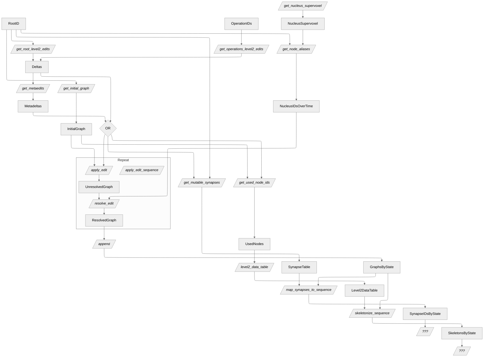

The diagram below describes some of the current functions in the `paleo` library, and
how they interact with each other. Note that you can click on anything underlined to be
taken to the corresponding reference documentation. The diagram is a work in progress and will
be updated as the library evolves.

