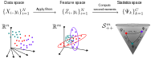
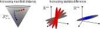

---
jupytext:
  text_representation:
    extension: .md
    format_name: myst
    format_version: 0.13
    jupytext_version: 1.16.2
kernelspec:
  display_name: python3
  language: python
  name: python3
---

# Geometry of SQFA

In this tutorial we provide a brief overview of the geometric perspective
of second-order statistics that underlies SQFA.

## Manifold of SPD Matrices

Symmetric Positive Definite (SPD) matrices are symmetric matrices whose
eigenvalues are all strictly positive. This type of matrix appears in many
statistics and machine learning applications. Some important examples
of SPD matrices are full rank covariance matrices and second moment matrices.

SPD matrices have a number of nice algebraic properties and a rich
geometrical structure, given that the set of $m \times m$ SPD matrices forms a Riemannian
manifold denoted $\mathcal{S}^m_{++}$.

The geometry of $\mathcal{S}^m_{++}$ (which is shaped like an open cone
in the space of symmetric matrices) is very well studied, and there are
formulas for computing distances, geodesics, means, and other
geometric quantities in this space.
SQFA is based on considering second-order statistics
of the data as points in $\mathcal{S}^m_{++}$, and it leverages this
geometric perspective for learning filters, as explained below.

:::{admonition} Riemannian manifolds
Riemannian manifolds are geometric spaces that locally look like Euclidean
spaces, but globally can have a more complex structure. The classical example
of a Riemannian manifold is the surface of a sphere. Locally, if we zoom in
enough the sphere looks like an Euclidean plane, but globally it is not an
Euclidean plane, as illustrated by the fact that we can follow a
"straight trajectory" and come back to the same point.

Riemannian geometry provides the tools to do usual geometric operations in
such spaces, like measuring distances, interpolating, finding averages, etc.

<figure>

  
  <figcaption>
  <b>Riemannian manifolds.</b>
  <i>The surface of the sphere is a non-Euclidean space, if we follow
  a "straight" trajectory we end up at the same spot. Riemannian geometry
  allows us to find quantities such as the average of a set of data points
  in a manifold.</i>
  </figcaption>

</figure>
:::

## Classes as points in the SPD manifold

SQFA is a technique for supervised filter learning, or dimensionality
reduction. This means that given a dataset $\{X_t, y_t\}_{t=1}^N$ where
$X_t \in \mathbb{R}^n$ are the data points with $n$ dimensions and $y_t$ are the class
labels, SQFA learns a set of filters, represented by a matrix
$F \in \mathbb{R}^{n \times m}$, $m<n$, where $m$ is the number of filters.
These filters are used to transform the data points $X_t$ into a
lower-dimensional feature space $F^T X_t = Z_t \in \mathbb{R}^m$,
generating the transformed dataset $\{Z_t, y_t\}_{t=1}^N$ of
data features. SQFA is supervised because it uses the class labels
$y_t$ to learn the filters.

In supervised feature learning the goal is to find features that are
useful for classification or estimation, i.e. that separate the classes well.
Importantly, such methods need to specify the way in which classes are to be
separated. The classical example is
[Linear Discriminant Analysis](https://en.wikipedia.org/wiki/Linear_discriminant_analysis)
(LDA), which learns linear features that maximize the separation between
class means, while minimizing the within-class variance in the transformed
dataset $\{Z_t, y_t\}_{t=1}^N$. Thus, LDA maximizes the first-order differences
between classes, by maximizing the Euclidean distances between the class means
$\mu_i = \mathbb{E}[Z | y=i]$ (normalized by the within-class variance).

<figure>

  
  <figcaption>
  <b>Geometry of data statistics.</b>
  <i>SQFA considers the geometry of the second-order statistics of
  the data features as points in the SPD manifold. The locations of the
  points in the SPD manifold depends on the filters that are applied to
  the dataset. We use Riemannian geometry to measure the
  distances between the statistics.</i>
  </figcaption>

</figure>

First-order differences, however may not capture all relevant differences
between classes. SQFA considers the second-order differences between classes,
which is the obvious next step. How should one represent second-order
differences between classes? SQFA uses Riemannian geometry to compute
distances between second-order statistics of the classes in 
the manifold $\mathcal{S}^n_{++}$. This is analogous to how LDA uses
Euclidean geometry to compute distances between first order
statistics (i.e. class means) in Euclidean space.

Consider again the dataset $\{X_t, y_t\}_{t=1}^N$ and its
feature space representation $\{Z_t, y_t\}_{t=1}^N$ generated by the filters $F$.
For each class $i$, we can compute the (non-centered) second moment matrix
of the features $\Psi_i = \mathbb{E}[ZZ^T | y=i]$.
The matrices $\Psi_i$ are $m \times m$ SPD matrices, and
so the $q$ matrices $\{\Psi_i\}_{i=1}^q$ define $q$ points in
the SPD manifold $\mathcal{S}^m_{++}$.

The insight behind SQFA is that larger Riemannian distances
between the second-order statistics of the classes $i$ and $j$
in the feature space, $d(\Psi_i, \Psi_j)$, are associated with more
discriminable classes.

<figure>

  
  <figcaption>
  <b>Manifold distance and discriminability.</b>
  <i>The idea behind SQFA is that the larger the Riemannian distance
  between the second moment matrices of the classes, the more different their
  second-order statistics, and the more discriminable they are. This idea is
  illustrated in the cartoon, which shows a baseline second-moment matrix as a
  point in the SPD manifold (grey star), and two trajectories in the manifold
  getting away from this baseline (red and blue stars). To the right, the
  ellipses corresponding to each second-moment matrix are shown. We see that
  as we go farther from the baseline distribution in the manifold, the second moments
  become more different from the baseline. In the red trajectory
  distributions become more different by rotating, and in the blue trajectory
  by shrinking.</i>
  </figcaption>

</figure>

SQFA uses as an objective function the sum of the pairwise Riemannian distances
(or squared distances) between the second moment matrices $\Psi_i$ of all classes, 
$U\left(\left\{\Psi_i\right\}_{i=1}^{i=q}\right) = \sum_{i=2}^{q}\sum_{j=1}^{i-1} d(\Psi_i,\Psi_j)$.
It learns the filters $F$ that maximize this objective.

:::{admonition} SQFA input types: Raw data vs statistics
The discussion in this tutorial takes us from raw data points $\{X_t, y_t\}$
to the second moments of the features $\{\Psi_i\}_{i=1}^q$. However,
we can also compute the second moments of the linear features directly from
the second moments of the data, $C_i = \mathbb{E}[X_t X_t^T | y=i]$,
using the formula $\Psi_i = F^T C_i F$.
Thus, SQFA can take as input either the raw data
points $\{X_t, y_t\}$ or the second moments $\{C_i\}_{i=1}^q$,
as seen in other tutorials. This can be particularly useful for cases
where we have access to the second moments but not to the raw data.
:::

## Riemannian metrics relate to discriminability

A key remaining question, however, is how to compute the Riemannian distance
$d(\Psi_i, \Psi_j)$ between two second-moment matrices, and in what way this
distance is related to the discriminability of the classes.
There are several Riemannian metrics compatible with $\mathcal{S}^m_{++}$
that can be used to measure distances between SPD matrices.
Thus we are faced with the question of which metric to use.

The most widely used metric in the $\mathcal{S}^m_{++}$ manifold 
is the Affine-Invariant Riemannian Metric (AIRM). This metric happens to be
related to the Fisher information of 0-mean Gaussian distributions,
which is a measure of the local discriminability of the distributions,
and to quadratic discriminability. The details are
beyond the scope of this tutorial, and further developed in the
[SQFA paper](https://openreview.net/pdf?id=vxdPzM18Xx), but this suggests
that the AIRM distance is a good choice for learning discriminative features.
The usefulness of the AIRM
distance for learning discriminative features is also empirically validated in
the paper and in the other tutorials.

:::{admonition} Centered vs non-centered second moments
:name: centered-vs-non-centered
Note that the discussion in the tutorial has focused on non-centered second
moment matrices $\Psi_i = \mathbb{E}[ZZ^T | y=i]$. Alternatively, we could
consider centered second moment matrices (i.e. covariance matrices),
which we denote as $\Sigma_i = \mathbb{E}[(Z-\mu_i)(Z-\mu_i)^T | y=i]$.
The two moments are related by the formula
$\Psi_i = \Sigma_i + \mu_i \mu_i^T$ (and they are the same when
$\mu_i=0$).

We focus on non-centered second moments because the distances between
these matrices more directly relate to the discriminability of the classes
by a quadratic decoder, as developed in the
[SQFA paper](https://openreview.net/pdf?id=vxdPzM18Xx). This is because
the non-centered moments include information about both the means and the
covariances of the classes.

However, covariance matrices are also SPD matrices and can be used as input
to SQFA. This can be useful, for example, for using SQFA in conjunction with
other methods that focus on first-order differences, or when SQFA is used
to learn features that keep the covariance structure of the data.
:::

In summary, SQFA leverages the geometric structure of the SPD manifold
to learn discriminative features by that maximizing the distances between
the second-order statistics of the classes in $\mathcal{S}^n_{++}$.
In the next tutorials we will learn how to use the `sqfa` package,
and how the features learned by SQFA compare to other methods.
