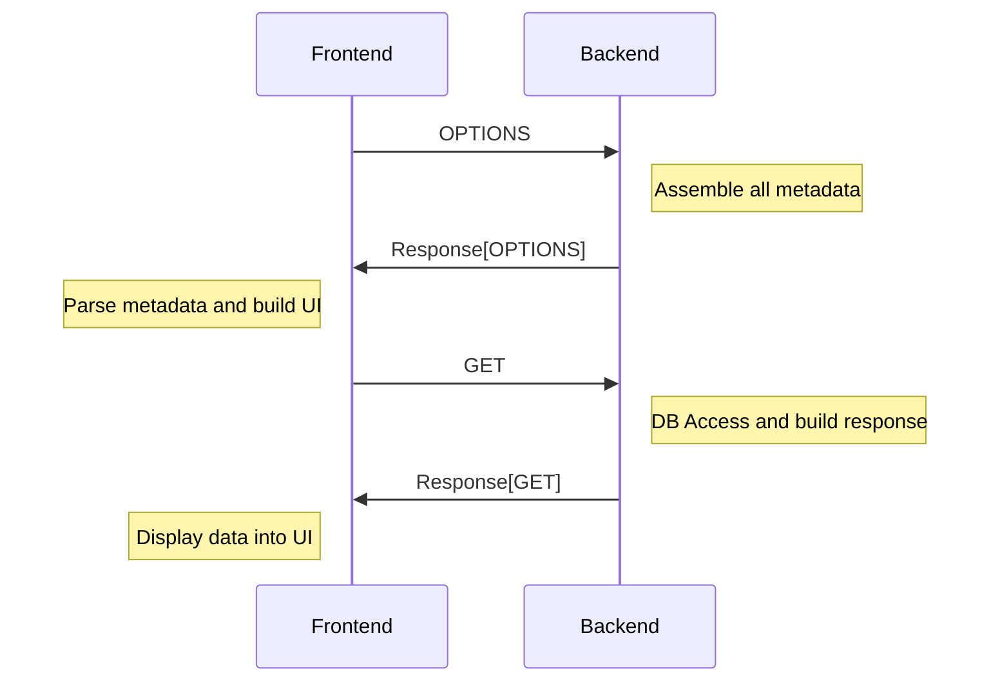

# Concept

The metadata is the heart of workbench. It is the glue between the backend and the frontend and what allows the developer to streamline the development and UI-Generation. In its essence the metadata takes configurations from python classes and parses them through the `OPTIONS` request in a predetermined format in order to tell the frontend what to display and how. Currently the following configurations are supported:

- [`fields`](configs/fields.md): The fields with their properties
- [`filter_fields`](configs/filter_fields.md): The available filters with their properties
- [`ordering_fields`](configs/ordering_fields.md): Which field can be ordered/sorted
- [`search_fields`](configs/search_fields.md): The fields that are used for searching
- [`pagination`](configs/pagination.md): The pagination method that is used
- [`identifiers`](configs/identifiers.md): How to uniquely identify something
- [`type`](configs/type.md): What is displayed (chart, form, table, ...)
- [`titles`](configs/titles.md): What title should be displayed
- [`endpoints`](configs/endpoints.md): What endpoint should be used for what action
- [`buttons`](configs/buttons.md): What additional button should be displayed where
- [`display`](configs/display.md): How to display the data
- [`primary_key`](configs/primary_key.md): What is the primary key

The general workflow mostly looks like this:

Since the instructions are rather generic and agnostic, the UI can be build on any device, such as a browser or a mobile app.
